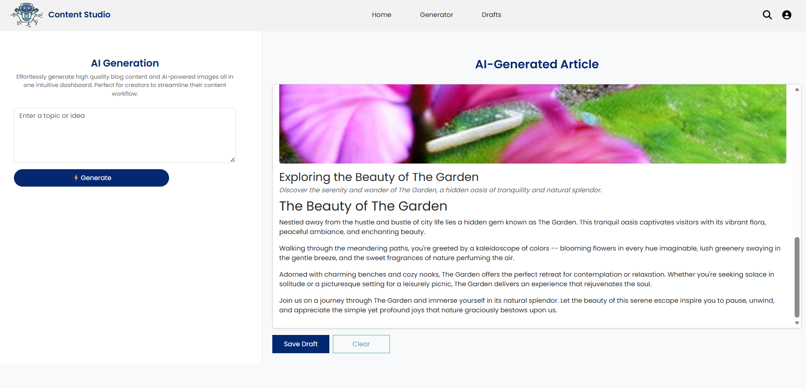

# 🚀 AI Content Studio: AI-Powered Article and Image Generator (PydanticAI + Replicate)

**✨ Summary:**  
AI Content Studio is an **AI-powered article generator website** that allows users to create **structured text content** and **AI-generated images** in one dashboard, making content creation fast, organized, and visually appealing.

---

## 🛠 Features

- **📝 Text Generation:**  
  Uses **PydanticAI** to structure blog/article output including **title, summary, and body**.

- **🖼 Image Generation:**  
  Uses **Replicate** to generate cover images automatically based on the generated title or summary.

- **👀 Preview Mode:**  
  Side-by-side card view displaying both **text** and **image** for easy review.

---

## 💻 Technology Stack

| Layer  | Technology  |
|------------------|--------------------|
| Frontend         | React.js, CSS, Bootstrap |
| Backend          | FastAPI, Python  |
| AI Services      | PydanticAI (text generation & validation), Replicate (image generation) |

---

## 🔄 Workflow

1. User navigates to the **Generate** page.  
2. Enter a prompt or topic.  
3. **Text content** is generated via **PydanticAI**.  
4. **Cover image** is generated via **Replicate** based on the title/summary.  
5. User can **preview** content and image side-by-side.  
6. Optionally, the user can **save the draft** to revisit later.

---

## 🎨 Output 

### 🏠 Home Page


### ✍️ Generate Page  


---

## 🌐 Live Demo

**🔗 Access Here:**  
[Open Live Demo](https://YOUR_LIVE_DEMO_LINK)

---

## ⚡ Installation & Run

```bash
# Clone the repo
git clone https://github.com/Linda-31/Content-Studio.AI.git
cd Content-Studio.AI

# Install dependencies
npm install       
pip install -r requirements.txt   

# Run backend (FastAPI)
uvicorn app:app --reload

# Run frontend
npm start
